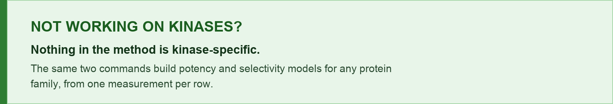

# Kinase Foundation Model - command line tools

Run the Kinase Foundation Models locally, on your own machine, against your own
compounds. Nothing is sent anywhere: the models run in your process.

**Project home: <https://kinasefoundationmodel.com>** - the same models in the
browser with no install, the research reports behind every number here, and the
limitations page:
[overview](https://kinasefoundationmodel.com/overview.html) ·
[rank by potency](https://kinasefoundationmodel.com/rank-potency.html) ·
[rank by selectivity](https://kinasefoundationmodel.com/rank-selectivity.html) ·
[limitations](https://kinasefoundationmodel.com/limitations.html)

**Model release: 12 August 2026.** Both models below come from that release, and
every number quoted in this file was measured on it.

| Released | Model | Question it answers | Command | Returns |
|---|---|---|---|---|
| **12 Aug 2026** | **Potency** | Of these compounds, which is more potent against **one** kinase? | `kfm potency` | which compound wins, with a **strength** |
| **12 Aug 2026** | **Selectivity** | Of these kinases, at which is **one** compound more potent? | `kfm selectivity` | which kinase wins, with a **strength** |
| **13 Aug 2026** | **Add-on · extend** | Can I add *my own* data to either model, keeping the whole panel? | `kfm extend` | a **merged model** |
| **13 Aug 2026** | **Add-on · buildnew** | Can I fit a model on *only* my data, using the same recipe? | `kfm buildnew` | a **model that is entirely yours** |

"More potent" spans binding affinity and functional potency together. A
comparison is always between two readings of the same kind, so the answer orders
like with like rather than claiming anything about binding in particular.

The two models are separate downloads. Installing one does not install the
other. Each section below is self-contained: install, hardware, and how to run,
start to finish.

[](docs/OTHER_FAMILIES.md)

> [!TIP]
> The featurizer, the pairwise formulation, the label-reversal swap, the
> censored-value logic and the forest work on any protein family for which you
> have sequences and activity data. Give `kfm buildnew` one measurement per row -
> `smiles`, `sequence`, `pic50` - and it builds the comparisons for you, for
> either model, from the same file.
>
> **→ [`docs/OTHER_FAMILIES.md`](docs/OTHER_FAMILIES.md)** - written from an
> end-to-end port of both layouts to GPCRs, 1.09M ChEMBL rows over 405 receptors.
>
> That port is now live and public at
> **[gpcrfoundationmodel.com](https://gpcrfoundationmodel.com/)** - the same two
> layouts over G protein-coupled receptors, with
> [its own methods](https://gpcrfoundationmodel.com/methods.html),
> [every target it covers](https://gpcrfoundationmodel.com/targets.html) and
> [its limitations](https://gpcrfoundationmodel.com/limitations.html). Use it as
> a worked example of what a port to another family looks like when it is finished.
>
> **[familyfoundationmodel.com](https://familyfoundationmodel.com/)** is the broad
> instrument beside both: two separately fitted models over 34 protein families,
> trained on ChEMBL 37 alone, with the same two layouts.

---

## Licensing - the code and the weights differ

| What | License |
|---|---|
| Everything in this repository | **Apache 2.0** (`LICENSE`) |
| The trained model weights, downloaded separately | **Research and evaluation only** (`LICENSE-MODELS.txt`) |

The weights are a derived work of the
[Eidogen-Sertanty Kinase Knowledgebase (KKB)](https://eidogen-sertanty.com/kinasekbmarvin.php),
a commercial database of curated kinase structure-activity measurements. They are
free for **academic and non-profit research and teaching**.

Two limits apply to everyone, including academic and non-profit users:

- **No license to the Knowledgebase is granted.** This lets you *run* a model
  trained on the KKB. It conveys no right to the KKB itself, to any part of it,
  or to any data in it. Access to the Knowledgebase is a separate commercial
  agreement.
- **No reverse engineering.** You may not decompile or reverse engineer the
  weights, nor attempt to extract, reconstruct, infer or approximate the
  Knowledgebase or any portion of it from the weights or their outputs -
  including by systematic or bulk querying.

See `LICENSING.md` for why the split exists, and `LICENSE-MODELS.txt` for the
full terms.

---

<details open>
<summary><b>▶︎ VERSION 2 - the current release (click to collapse)</b></summary>

<br>

Both models are **classifiers**. They answer a comparison with an ordering
and a strength. **Neither returns a potency, an affinity, or a statement that a
compound is active.** Read the ordering; use the confidence to decide which parts
of it to act on.

In both diagrams the encoder boxes are colored by **role**: the two paired
inputs being compared are neutral, and the single shared input - the sequence for
potency, the ligand for selectivity - is blue.

![Potency model. Ligand A, one kinase sequence and ligand B enter a single random forest in that fixed order. Each ligand goes through a 1,024-bit Morgan count fingerprint plus 14 descriptors covering size, topology and composition; the sequence goes through ESM2, mean-pooled to 480 numbers. The forest returns the probability that ligand A is the more potent of the two, shown on a bar running from more potent at A to more potent at B with confidence marked at its center. The worked case is bosutinib, measured pIC50 8.96, against a pyrazolo[3,4-d]pyrimidine at 4.50, on the ABL1 kinase domain, RCSB 3UE4.](docs/arch-potency-20260812.png)

*Potency - ligand A, the sequence, ligand B, as one row. Every pair is scored in
both ligand orders and averaged.*

![Selectivity model. Sequence A, one ligand and sequence B enter a single random forest in that fixed order. Each sequence goes through ESM2, mean-pooled to 480 numbers; the ligand goes through a 1,024-bit Morgan count fingerprint plus 14 descriptors covering size, topology and composition. The forest returns two probabilities that sum to 1, shown on a bar running from protein A has greater affinity to the ligand to protein B has greater affinity. The worked case is dasatinib between ABL1, UniProt P00519, 1,130 residues, and GSK3B, UniProt P49841, 420 residues.](docs/arch-selectivity-20260812.png)

*Selectivity - sequence A, the ligand, sequence B. The position is the question.*

---

### 1️⃣ Install - one command, source and both models

```bash
git clone https://github.com/smuskal/KFM.git
cd KFM
./install.sh
```

That is the whole install. It builds a private environment in `./env`, downloads
**both** models into `./kfm-models`, and then proves it works by
scoring the published worked example - if ranking bosutinib against the PP1-type
compound on ABL1 does not put bosutinib first at 0.85, it fails rather than
reporting success.

Everything stays inside the `KFM` folder. No global environment is created or
changed, nothing is written to your home directory, and deleting the folder
removes every trace. It uses conda when it can find it and falls back to
Python's own `venv` when it cannot.

| Command | Installs |
|---|---|
| `./install.sh` | both models |
| `./install.sh potency` | potency only |

**Requirements.** Python 3.10 to 3.13, Intel or Apple Silicon, Linux, macOS or
Windows. **RAM is the real constraint** - these forests expand about sevenfold
when loaded:

| Model | Download | RAM to run |
|---|---|---|
| potency | 0.76 GB | **5 GB** |
| selectivity | 2.84 GB | **22 GB** |

A 16 GB laptop runs potency comfortably but **cannot load selectivity** - it will
swap and then be killed by the operating system. Both download either way; the
installer warns before fetching something this machine cannot run.

**Verifying the install.** `./install.sh` already checks itself: it scores the
published worked examples and fails rather than reporting success if any has
moved. If the install said it succeeded, those passed.

The full suite ships with the repository:

```bash
./env/bin/python -m pytest tests/ -q
```

61 tests. Those needing a bundle skip with a reason when its weights are absent,
so a default install should run all 61. **Skips mean a bundle is missing, not
that everything is fine.** To run only the tests that need no weights:

```bash
./env/bin/python -m pytest tests/ -q -m "not needs_bundle"
```

<details>
<summary><b>❌ "command not found: git" (click to expand)</b></summary>

<br>

**macOS** - run `xcode-select --install` and accept the dialog, or download from
<https://git-scm.com/download/mac>.
**Windows** - installer at <https://git-scm.com/download/win>; afterwards use
**Git Bash**, not Command Prompt.
**Linux** - `sudo apt install git` or `sudo dnf install git`.

**Or skip git entirely:** at <https://github.com/smuskal/KFM> click the green
**Code** button, choose **Download ZIP**, unzip, and `cd` into the folder.
Everything else is identical.

</details>

<details>
<summary><b>❌ "command not found: python" (click to expand)</b></summary>

<br>

Try `python3` first. If neither exists, install Python 3.12 from
<https://www.python.org/downloads/> and open a new terminal. On Windows, tick
**"Add Python to PATH"** in the installer or Windows will not find it.

</details>

### 2️⃣ Run it

**Always use `./kfm.sh`.** It runs the environment the installer built. Typing
plain `python -m kfm` uses whatever Python your shell happens to have - usually a
base conda install with a different scikit-learn, which cannot load these models.

**Potency - rank compounds against one kinase:**

```bash
./kfm.sh potency --target ABL1 \
  -l "COc1cc(Nc2c(cnc3cc(OCCCN4CCN(C)CC4)c(OC)cc23)C#N)c(Cl)cc1Cl bosutinib" \
  -l "CC(C)n1nc(c2cccnc2)c3c(N)ncnc13 PP1-type"
```

```
Potency ranking against ABL1

#  Compound   SMILES                                                       Score  Confidence
-  ---------  -----------------------------------------------------------  -----  ----------
1  bosutinib  COc1cc(Nc2c(cnc3cc(OCCCN4CCN(C)CC4)c(OC)cc23)C#N)c(Cl)cc1Cl  0.847        0.85
2  PP1-type   CC(C)n1nc(c2cccnc2)c3c(N)ncnc13                              0.153        0.85
```

Same columns, same order, same values as the website for the same input. The
command line and the page are two views of one run.

**Score** is how often a compound comes out the more potent of a pair, averaged across
every comparison it took part in. It is *relative to the compounds you supplied* -
change the rivals and it changes.

**Selectivity - compare 2 to 5 kinases:**

```bash
./kfm.sh selectivity -t MTOR -t PIK3CA -t PIK3CG \
    -l @examples/selectivity_MTOR_PIK3CA_PIK3CG.smi
```

```
Selectivity across MTOR, PIK3CA, PIK3CG
3 comparisons per compound

Compound                                            SMILES                                                                        MTOR  PIK3CA  PIK3CG
--------------------------------------------------  ----------------------------------------------------------------------------  ----  ------  ------
cpd2_MTOR_9.22_PIK3CA_6.91_PIK3CG_6.70_best_MTOR    CN(C)c1cccc(c1)c2ccnc3c2c(\C=C\4/Oc5cc(O)cc(O)c5C4=O)cn3C                     0.94    0.47    0.09
cpd1_MTOR_3.31_PIK3CA_8.46_PIK3CG_7.65_best_PIK3CA  CC(C)N1CCCN(CC1)c2nc(nc(n2)c3ccc(NC(=O)Nc4ccc(cc4)C(=O)N5CCNCC5)cc3)N6CCOCC6  0.30    0.90    0.31
cpd3_MTOR_7.30_PIK3CA_6.69_PIK3CG_5.80_best_MTOR    FC(F)(F)c1ccc(NC(=O)Nc2ccc(cc2)c3nc(nc(n3)N4CCOCC4)N5CCOCC5)nc1               0.81    0.62    0.07
```

One column per kinase, as the website's heat map lays them out; the largest
number in a row is the kinase that compound prefers. Every unordered pair is
scored, so N kinases is N(N−1)/2 comparisons per compound. Five is the cap
because 45 comparisons per compound stops being readable.

**0.50 means no preference** - across a row the scores average to exactly 0.50 by
construction, so the signal is distance from it. And **a preferred side is not
activity**: every comparison names a winner, so something always wins, including for a
compound that binds nothing.

These example files carry the measured answer in each compound's name, so you can
check the models rather than trust them. All three pick the right kinase, and
potency puts five ABL1 compounds spanning 8 log units in exactly the right order.
See [`examples/README.md`](examples/README.md).

```bash
./kfm.sh where     # where the models are, and the RAM each needs
```

### 3️⃣ What leaves your machine

`./install.sh` fetches the models once. **After that, nothing.** Predictions run
entirely in your own process - your compounds, targets and results never leave
the machine, and the tool works with the network switched off.

The download brings the **complete** model, including the protein side: the
precomputed ESM2 sequence embeddings travel inside each bundle (733 sequences for
potency, 728 for selectivity), so choosing a kinase by gene symbol is a local
lookup. ESM2 itself never runs unless you paste a sequence the model was not
trained on, which needs the optional `requirements-sequences.txt`.

### 4️⃣ Reading the numbers

**Headline accuracy on unseen ChEMBL.** Potency ranks two compounds against one
kinase at **0.69** over 1,836,100 comparisons. Selectivity picks which of two
kinases prefers one compound at **0.75** over 3,137,588.

Two tables follow. They answer different questions, so they do not match, and
neither is wrong.

**Cumulative** - every comparison at or above the cutoff. This is what the
published figures and the paper's Figure 3 report:

| At 0.70 and above | Accuracy | Comparisons kept |
|---|---|---|
| Potency | 0.88 | 15.3% |
| Selectivity | 0.92 | 36.8% |

**Within each band** - only the comparisons landing inside that range:

| Confidence | Potency | Selectivity |
|---|---|---|
| 0.90 - 1.00 | 0.89 | 0.99 |
| 0.80 - 0.90 | 0.90 | 0.96 |
| 0.70 - 0.80 | 0.87 | 0.88 |
| 0.60 - 0.70 | 0.78 | 0.74 |
| 0.50 - 0.60 | 0.60 | 0.58 |

Potency not rising all the way to the top is real, not a transcription error: it
plateaus near 0.90 and its top band is thin. It is scored the way this tool scores
it, averaging both ligand orders. **The columns are not interchangeable** -
different test sets, so read down a column, not across.

**Confidence is not a calibrated probability** and does not transfer between
distributions. A 0.70 call is right about 0.98 of the time on the potency model's
own training distribution and 0.99 on the selectivity model's, but 0.88 and 0.92 on
held-out ChEMBL. Set the cutoff from the test figures for the model you are
running.

Two cautions specific to potency. **Only 15.3% of comparisons reach 0.70 at all,
and 57.1% land in the bottom band**, so most of a run sits below the operating
point and much of that is barely better than a coin flip. And accuracy falls as
the chemistry gets newer: scored by each test compound's maximum Tanimoto
similarity to the compounds actually fitted on, potency runs at **0.58** where
both compounds are novel, below 0.35, against **0.72** at fingerprint identity.
That novel corner is the screening case.

Full limitations: **<https://kinasefoundationmodel.com/limitations.html>**
Method and every figure:
[potency report](https://kinasefoundationmodel.com/reports/LigASeqLigB_v2_potency.html) ·
[selectivity report](https://kinasefoundationmodel.com/reports/SeqALigSeqB_v2_selectivity.html)

</details>

---

<details>
<summary><b>▶︎ ADD-ONS - use your own data (click to expand)</b></summary>

<br>

Two utilities. Both run entirely on your machine; no data is transmitted.

| | `kfm extend` | `kfm buildnew` |
|---|---|---|
| what it does | merges trees fitted on your data into a released model | fits a model on your data alone |
| KFM weights | loaded and merged | none loaded |
| coverage | the whole 500-kinase panel | your targets only |
| license | `LICENSE-MODELS.txt` §3(d) | no KFM encumbrance |

Measured on a contributor with 119,660 comparisons across five targets:

| model | their 5 targets | 10 other targets |
|---|---|---|
| released KFM | 0.7027 | 0.7346 |
| `kfm extend`, +20 trees | 0.7131 | 0.7326 |
| `kfm buildnew` | 0.7761 | 0.6192 |

`buildnew` overtakes the released model on your own targets at roughly 10,000
comparisons. Off-target accuracy stays near 0.61 regardless of volume.

Runnable now, against the files in `examples/`:

```bash
# fit on your data alone, no KFM weights involved
./kfm.sh buildnew --layout potency \
    --data examples/measurements_example.csv --out ./my_model --allow-small

# merge your data into a released model
./kfm.sh extend --model potency \
    --data examples/extend_potency_example.csv --out ./extended --allow-small
```

`--allow-small` is needed only because the shipped examples are deliberately
tiny. On real data, drop it and add a holdout so the tool measures rather than
guesses how many trees to add:

```bash
./kfm.sh extend --model potency --data mine.csv --out ./mine \
    --sweep --holdout mine_holdout.csv
```

### Data too big to fit in memory

`buildnew` handles it automatically. Nothing to pass.

Every comparison is entered twice as float32, so the design matrix is
`2 x comparisons x features x 4` bytes: 2,556 features for potency, 1,998 for
selectivity. That reaches 64 GB at about four million comparisons. When it will
not fit, `buildnew` fits in chunks and pools the trees, and says so:

```
design matrix 45,000,000 x 2,556 (428.47 GB) after the swap
  fitting in 14 chunks of about 30.61 GB, pooling the trees
  chunk 1/14: 1,607,143 comparisons, 22 trees, 1204s -> chunk_001.joblib
```

Trees are independent, so forests fitted on different samples merge into one by
concatenating them. Each chunk holds an even share of every target, so a heavily
measured kinase cannot crowd out the rest. Chunks are checkpointed, so an
interrupted run resumes instead of restarting.

| flag | use |
|---|---|
| `--max-memory-gb G` | how much the matrix may use. Default: half this machine |
| `--chunks N` | force a chunk count. `1` forces a single fit |
| `--checkpoint-dir DIR` | where chunk forests go. Default `<out>/chunks` |

`--trees` stays the total across all chunks, not per chunk.

**Chunking is a memory trade, not a free win.** Each tree sees one chunk, so with
your data held fixed more chunks means weaker trees. On a 40,402 comparison set,
holdout accuracy fell from 0.77 in one chunk to 0.71 in twenty. Use the fewest
chunks your memory allows, which is what the automatic choice does. Chunking pays
when it lets you fit data that would not fit at all.

### Your data: one CSV, in whichever shape you already have

Both tools read both shapes and detect which one they were given. Prefer the
first: it is what a knowledgebase or ChEMBL export already looks like, and one
file builds either model.

**Measurements** - one ligand, one target, one value per row:

```
smiles,gene,pic50,relation
Cc1cc(Nc2ncc(C)c(N3CC(CC#N)(N4CCCC4)C3)n2)sn1,ABL1,5.45,=
Cc1ccc(NC(=O)C2CCC2)c(F)c1-c1ccc2cc(NC(=O)C3CC3)ncc2c1,ABL1,9.7,=
CN(C)CCCN1c2ccccc2Sc2ccc(Cl)cc21,EGFR,4.54,=
```

Required: `smiles`, a target, and a value. The target is `gene` for a kinase the
model knows or `sequence` for anything else, including a non-kinase family. The
value is `pic50`, `pvalue` or `pactivity`. `relation` is optional.

The **same file builds either model**, because only the grouping differs:
potency pairs the ligands measured on each target, selectivity pairs the targets
each ligand was measured against. The tools do the pairing.

**Comparisons** - already paired, if that is what you hold. Only the pair
differs between the two models:

```
# potency: two ligands, one target
smiles_a,gene,smiles_b,pic50_a,pic50_b,relation_a,relation_b

# selectivity: one ligand, two targets
smiles,gene_a,gene_b,pic50_a,pic50_b,relation_a,relation_b
```

Substitute `sequence`, `sequence_a`, `sequence_b` for the `gene` columns as
above. In place of the two values you may give a single `winner` column of `A`
or `B`. A file holding these columns is never reinterpreted as measurements.

**What the tools do to it.** Duplicates are collapsed by median. Which member is
A is randomized, so the forest cannot learn to score by reading a slot. Every
usable comparison is then entered twice, once in each order with the label
inverted, so do not supply both orders yourself. `--pairs-per-group` (default
5,000) stops one deeply screened target dominating.

**Read the unpaired count before trusting the model.** Both tools report what
they could not pair. A file rich enough for potency is often thin for
selectivity, which needs the same compound measured on two different targets.

> [!TIP]
> **🧬 Another target family?** Nothing here is kinase-specific - the same two
> commands build potency and selectivity models for any family from the same
> measurement file. **[`docs/OTHER_FAMILIES.md`](docs/OTHER_FAMILIES.md)** has
> the full procedure, from an end-to-end GPCR port, and
> [gpcrfoundationmodel.com](https://gpcrfoundationmodel.com/) is that port running
> in public.

**Qualifiers invert on conversion.** Our `relation` describes the potency: `>`
means at least this potent. ChEMBL and most assay exports put the qualifier on
the concentration, so `IC50 > 1000 nM` becomes `pic50 6.0, relation <`. Copying
it across without inverting labels weak compounds as potent and produces no
error.

**Shipped examples with known answers.** Measurements:
[`measurements_example.csv`](examples/measurements_example.csv), 60 rows, builds
either model. Comparisons:
[`extend_potency_example.csv`](examples/extend_potency_example.csv), 18 rows, 16
usable, 2 dropped ·
[`extend_selectivity_example.csv`](examples/extend_selectivity_example.csv), 16
rows, all usable. All three need `--allow-small`, being far below the volume
either tool would otherwise insist on.

Full documentation: **[`docs/EXTEND.md`](docs/EXTEND.md)** ·
specification and validation record:
[`docs/KFM_EXTEND_SPEC.md`](docs/KFM_EXTEND_SPEC.md)

</details>

---

## Shared reference

### Input formats

`--ligand` / `-l` takes a SMILES, `"SMILES name"`, or `@file`:

- `.smi` / `.txt` - one per line, optional name after whitespace or a tab; `#` starts a comment line
- `.csv` - a header naming a `smiles` column, optionally `name`

`--target` / `-t` takes a gene symbol, or `@file` holding a protein sequence
(FASTA headers are stripped). Scoring a sequence the model was **not** trained on
additionally needs `pip install -r requirements-sequences.txt`, and comes with no
accuracy figure.

### Where the weights live, and how to move them

**`./kfm-models`**, in the directory you ran the download from - in plain sight,
not in a hidden cache under your home directory.

```bash
export KFM_HOME=/path/to/models
```

**Do not point `KFM_HOME` inside Dropbox, iCloud or Drive.** A multi-gigabyte
forest in a synced tree gets uploaded, re-downloaded on every machine you own,
and counted against your quota.

Already have a bundle? Point at it rather than downloading:

```bash
export KFM_BUNDLE_V1=/path/to/kfm_v1_potency
export KFM_BUNDLE_POTENCY=/path/to/LigASeqLigB_v2_potency
export KFM_BUNDLE_SELECTIVITY=/path/to/SeqALigSeqB_v2_selectivity
```

**Disk.** About 4.5 GB for all three bundles, plus the same again transiently
during download (each file is written to `.part` and renamed only after its
checksum verifies).

### A fully self-contained trial

Creates a conda environment and downloads the weights **inside one directory**,
touching nothing else on your machine. Delete the directory and every trace is
gone.

```bash
./scripts/contained-test.sh /path/to/scratch
```

### Other commands

```bash
./kfm.sh targets v1                   # every kinase a model covers
./kfm.sh targets potency
./kfm.sh targets selectivity -s CDK   # filtered
./kfm.sh where                        # where the weights are, and RAM needed
./kfm.sh potency --target ABL1 \
  -l "COc1cc(Nc2c(cnc3cc(OCCCN4CCN(C)CC4)c(OC)cc23)C#N)c(Cl)cc1Cl bosutinib" \
  -l "CC(C)n1nc(c2cccnc2)c3c(N)ncnc13 PP1-type" --json    # machine-readable
```

### A note on SMILES in this document

**Never truncate a SMILES.** Every structure above is complete and pastes
straight into a shell, a notebook or the website, and the same holds for the
tool's output, the reports and the web pages. Two different compounds can share
their first forty characters, so an ellipsis loses the identity of the very thing
being ranked. If a table is too wide, wrap it or let it scroll.

### What the models were trained on

Both models were fitted on the
**[Eidogen-Sertanty Kinase Knowledgebase (KKB)](https://eidogen-sertanty.com/kinasekbmarvin.php)** - and on nothing else.
No ChEMBL, no BindingDB, no other source went into training; ChEMBL was used
exclusively as an unseen test set, which is where every accuracy figure quoted
here comes from.

| Quantity | Potency | Selectivity |
|---|---|---|
| Measurements pulled from the KKB | 841,187 | 841,187 |
| Measurements retained after featurization | 840,692 | 841,094 |
| Distinct ligands | 302,999 | 99,739 |
| Distinct target sequences | 733 | 728 |
| **Comparisons the forest was fitted on** | **15,256,017** | **4,340,117** |
| Rows after the label-reversal swap | 40,056,452 | 8,680,234 |
| Held-out ChEMBL comparisons scored | 1,836,100 | 3,137,588 |
| Targets covered by that test | 477 | 482 |

A comparison is built from a pair of measurements, so the comparison counts run
far ahead of the measurement count: one kinase measured against 1,000 compounds
yields 499,500 ordered pairs from 1,000 experiments. Targets are keyed by
sequence, so a mutant is a target in its own right. Any test comparison whose
exact target and ligand pair appears in training is removed before scoring.

The KKB is a commercially licensed collection of curated kinase structure-activity
data. It is the reason these models exist, the reason the weights are licensed
separately from this code, and the thing to license if you want to go beyond
research and evaluation use: **<https://eidogen-sertanty.com/kinasekbmarvin.php>**

---

## Citing

> Kinase Foundation Model, Eidogen-Sertanty, Inc., 2026. Model release 12 August 2026.
> Trained on the Eidogen-Sertanty Kinase Knowledgebase (https://eidogen-sertanty.com/kinasekbmarvin.php).
> https://kinasefoundationmodel.com

The architecture diagrams in `docs/` are © 2026 Eidogen-Sertanty, Inc., all
rights reserved, included for documentation and **not** covered by the Apache
license on the code. See `NOTICE`.

© 2026 Eidogen-Sertanty, Inc.
